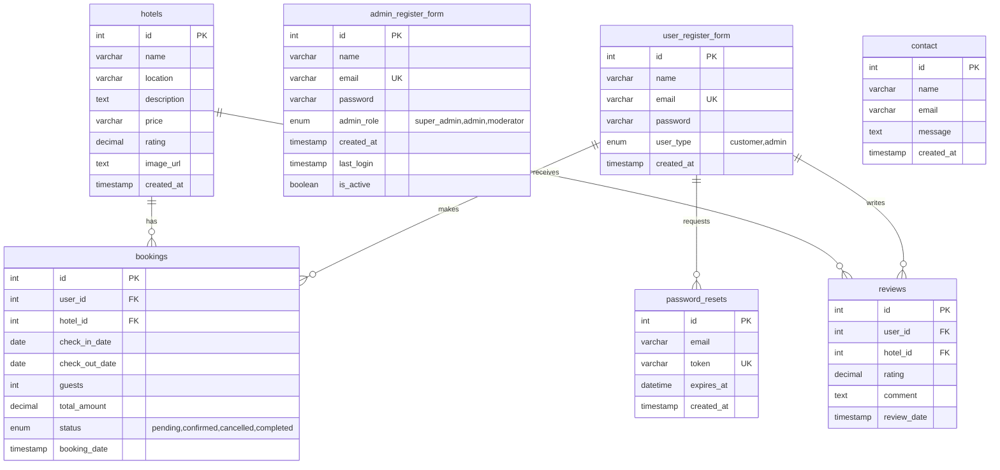

# PahunaGhar Database ER Diagram (Excluding Payment Options)

## Entity Relationship Diagram

## Database Schema Details

### 1. User Management Tables

#### `user_register_form`
- **Purpose**: Stores customer and admin user accounts
- **Key Fields**: 
  - `id`: Primary key
  - `email`: Unique identifier for login
  - `user_type`: Distinguishes between customers and admins
  - `created_at`: Account creation timestamp

#### `admin_register_form`
- **Purpose**: Dedicated admin user management
- **Key Fields**:
  - `admin_role`: Hierarchical roles (super_admin, admin, moderator)
  - `is_active`: Account status management
  - `last_login`: Track admin activity

#### `password_resets`
- **Purpose**: Handles forgot password functionality
- **Key Fields**:
  - `token`: Secure reset token
  - `expires_at`: Token expiration for security

### 2. Hotel Management

#### `hotels`
- **Purpose**: Stores hotel information and details
- **Key Fields**:
  - `name`, `location`: Basic hotel info
  - `price`: Cost per night
  - `rating`: Average user rating
  - `image_url`: Hotel photos

### 3. Booking Management

#### `bookings`
- **Purpose**: Manages hotel reservations
- **Key Fields**:
  - `user_id`, `hotel_id`: Foreign keys to users and hotels
  - `check_in_date`, `check_out_date`: Stay duration
  - `guests`: Number of people
  - `total_amount`: Booking cost
  - `status`: Booking lifecycle management

### 4. Review System

#### `reviews`
- **Purpose**: User feedback and ratings
- **Key Fields**:
  - `user_id`, `hotel_id`: Links to user and hotel
  - `rating`: 1-5 star rating
  - `comment`: Text feedback
  - Unique constraint: One review per user per hotel

### 5. Contact Management

#### `contact`
- **Purpose**: Stores contact form submissions
- **Key Fields**:
  - `name`, `email`: Contact information
  - `message`: User inquiry content

## Key Relationships

1. **User-Booking**: One user can make multiple bookings
2. **Hotel-Booking**: One hotel can have multiple bookings
3. **User-Review**: One user can write multiple reviews
4. **Hotel-Review**: One hotel can receive multiple reviews
5. **User-Password Reset**: One user can request multiple password resets

## Constraints and Business Rules

- **Unique Email**: Each user must have a unique email address
- **Review Uniqueness**: Users can only review each hotel once
- **Rating Range**: Reviews must be between 1-5 stars
- **Booking Status**: Bookings follow a defined lifecycle (pending → confirmed → completed/cancelled)
- **Admin Hierarchy**: Super admins have highest privileges, followed by admins and moderators

## Excluded Payment Tables

The following payment-related tables were excluded as requested:
- `esewa_users`: Esewa payment user accounts
- `khalti_users`: Khalti payment user accounts 